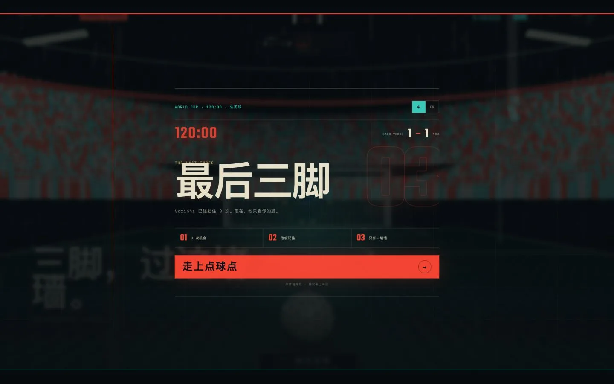

# Last Kick

一场发生在第 120 分钟的三脚射门挑战。选择爆射、弧线或勺子，按住足球蓄力、拖动瞄准、松手射门；但不要重复同一种射法和方向——门将会记住上一脚。

[在线试玩](https://lastkick.01mvp.com) · [完整免费案例：如何用 GPT-5.6 把它做出来](https://01mvp.com/docs/cases/last-kick-gpt56)

[](https://lastkick.01mvp.com)

> AI 只参与开发过程。游戏上线后不接入 AI，也不依赖任何运行时业务 API；场景、规则、音效和分享图都在浏览器本地运行。

## 为什么做这个项目

Last Kick 不是“一句话生成游戏”的演示，而是一次从普通原型到可传播网页作品的完整迭代：先找到一个三秒能懂的核心动作，再逐轮打磨镜头、紧张感、难度、声音、失败反馈和分享动机。

完整的起始提示词、关键迭代指令、踩坑记录和最终提示词全部公开在 [01MVP 实战案例](https://01mvp.com/docs/cases/last-kick-gpt56) 中。

## 玩法与特性

- **三脚挑战**：每局只有三次机会，结果会汇总成可分享的挑战战绩。
- **三种射法**：爆射适合低角，弧线需要拉向远角，勺子强调中路和力量控制。
- **门将记忆**：连续使用同一种射法并打向同一侧，门将会提前判断。
- **确定性难度**：相同输入永远产生相同结果，没有隐藏随机数；每次失败都能得到可执行的修正提示。
- **压力演出**：第 120 分钟开场、镜头推进、呼吸与心跳、球场屏息、出脚静音、扑救和进球欢呼共同制造紧张感。
- **程序化 3D**：球场、抽象观众、门将、雨、轨迹、球网和灯光均由代码生成，不依赖人物照片或外部 3D 模型。
- **中英文界面**：根据浏览器语言选择默认文案，也可以手动切换。
- **离线分享图**：浏览器使用 Canvas 生成 `1080×1920` PNG；支持 Web Share 的设备可直接分享，其他设备下载图片并复制挑战链接。
- **移动端优先**：触控操作、响应式 HUD、降低动态效果模式和自适应 WebGL 像素比。

## 难度不是暗骰子

射门结果由瞄准位置、力量、射法和上一脚计划共同决定。核心规则集中在 `src/experience/store.ts`，甜区也是界面提示与最终判定共用的唯一数据源。

仓库包含一组固定输入走廊的校准测试：熟练操作下，三种射法的有效进球空间约为 `25%–35%`；更宽松的新手输入模型约为 `13.9%/脚`。这些数字用于防止规则修改后意外变得过易或过难，不代表真实玩家的必然进球率。

```bash
node scripts/verify-shot-difficulty.mjs
```

## 技术栈

- React 19 + TypeScript 5.9 + Vite 8
- Three.js + React Three Fiber
- Zustand 状态管理
- Web Audio API：程序化心跳、风切、碰撞和混音
- Canvas 2D：本地生成挑战分享图
- Fontsource：字体随构建产物自托管
- Cloudflare Workers Static Assets + Wrangler

## 本地运行

需要 Node.js 24+ 和 pnpm 11+。

```bash
pnpm install
pnpm dev
```

常用入口：

- `/`：公开挑战。
- `?intro=1`：强制显示比赛开场；`?intro=0`：跳过开场。
- `?lab=1&variant=A|B|C`：打开内部观众方案实验器。
- 在实验地址后添加 `&clean=1`：隐藏实验控件。

键盘可用 `1 / 2 / 3` 切换射法，`R` 在结果阶段重新开始。

## 验证与构建

```bash
node scripts/verify-shot-difficulty.mjs
pnpm build
pnpm preview
```

提交改动前，请至少手动检查一次移动端尺寸下的完整三脚流程、声音解锁、中英文切换和分享图生成。

## 部署

`wrangler.jsonc` 已配置 Cloudflare Workers Static Assets。部署到自己的 Cloudflare 账户前，请先修改 Worker 名称和自定义域名；不要直接复用项目的生产域名。

```bash
pnpm deploy:dry-run
pnpm deploy
```

## 项目结构

```text
src/
├── experience/   # 游戏状态、确定性判定、文案与逐帧运行数据
├── scene/        # Three.js 球场、镜头、射门、门将与程序化观众
├── audio/        # Web Audio 编排与本地录音混音
├── share/        # 1080×1920 挑战卡生成
├── App.tsx       # 交互流程与 HUD
└── styles.css    # 视觉系统与响应式布局
public/audio/     # 本地 CC0 音频及来源说明
scripts/          # 难度校准与开发辅助脚本
wrangler.jsonc    # Cloudflare 静态资产部署配置
```

## 音频与许可

代码与项目原创内容采用 [MIT License](LICENSE)。`public/audio/` 中的现场录音为 CC0 素材，不需要署名，但仓库仍保留了来源、处理方式和 SHA-256 以便追溯；详见 [`public/audio/README.md`](public/audio/README.md)。

## 参与贡献

欢迎提交 Issue 和 Pull Request。开始前请阅读 [CONTRIBUTING.md](CONTRIBUTING.md)，尤其注意保持确定性规则、运行时无 AI/API，以及新增素材的许可可追溯性。
